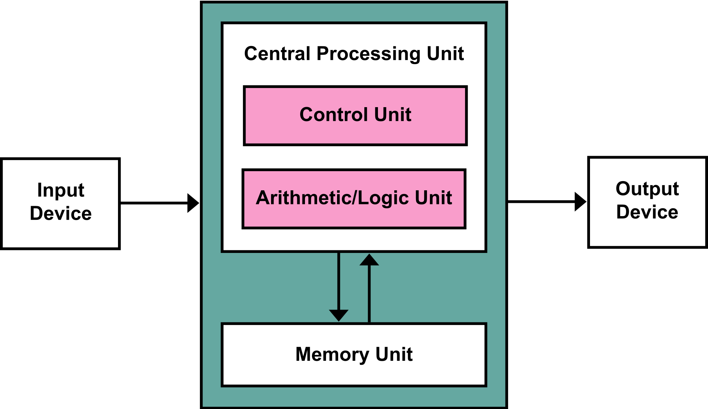
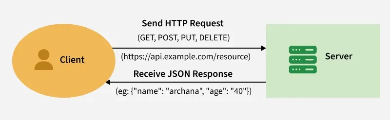

<!-- _class: titlepage -->

# Web APIs

## Based on "Databases in other applications"

Credit: Ed Longford

---

# Plan for today...

- **Tiers and layers**: a quick overviww (you may have seen this in databases...)
- **Rest APIs**: what they are, and how to build them.
- **Coding challenge**: build a web app in JavaScript which uses a rest API.

---

<!-- _class: titlepage invert -->

# One, Two and Three Tier Architectures and Layers

---

# Architecture, tiers and layers

- **Architecture**: splitting a computer system up into its components.

  - Here we'll mostly be looking at hardware architecture.

  - **Tier**: collection of hardware components -- the system is split into tiers.

  - Historically physical, but could also include logical.

  - Typically one, two and three tiered architectures are used. 
  
- **Layers:** different from tiers, another way of dividing up a system by splitting up logical components.

---

# Hardware Architecture

- Each piece of hardware is viewed as a "*black box*".

- All we need to know is it's expected inputs and outputs - we don't need to care about its implementation details.

- E.g., a database server stores data, which is manipulated or accessed using some kind of program.

---

# Computer system architecture



---

<!-- _class: right-img -->

# One tier architecture

- Everything is contained in one program / physical server

- Simplest, but least robust and secure. 


---

<!-- _class: right-img -->

# Back to layers

- Typically (optimistic) software is not a mess, so a lemon meringue pie, a **layered** desert might be a better analogy. Three layers:

    1. **Presentation:** the crisp top of the meringue,

    2. **Application:** (or business logic) the gooey meringe,

  3. **Data:** tart (bitter?) lemon curd.


---

<!-- _class: right-img -->

# Three Layer Architecture

1. **Presentation:** the crisp top of the meringue

    - User interface -- the pretty part which the user sees and interacts with.

    - HTML, CSS and JavaScript -- you've been decorating deserts during Web Dev 1 so far...


---

<!-- _class: right-img -->

# Three Layer Architecture

2. **Application:** (or business logic) is the gooey meringue, providing shape to the system.

    - handles calculations and operations, providing a link between the user interface and the database.

    - Potentially any language, in web apps it was historically PHP but could be almost any language: Ruby, Python, JavaScript, Java...


---

<!-- _class: right-img -->

# Three Layer Architecture

3. **Data:** the tangy, slightly bitter lemon curd.

    - Where all data is stored, application layer modifies / inserts / retrieves data and passes it to the presentation layer to be shown to the user.

    - Commonly a database.


---

# Today, we'll focus on the presentation and application layers...

We'll leave the database layer for Ed ;)

---

<!-- _class: right-img -->

# 2 Tier Architecture

- **Three layers** are divided across **two** (physical or logical) **tiers**.

- There will be a **communication layer** between the two tiers.


---

<!-- _class: right-img -->

# There are two options

1. **Top**: caramel and chocolate
    - Presentation
    - Application
2. **Bottom**: shortbread biscuit
    - Data


---

<!-- _class: right-img -->

# There are two options

1. **Top**: Royal icing
    - Presentation
2. **Bottom**: cake
    - Application
    - Data


---

<!-- _class: right-img -->

# Three Tier Architecture

- Like a **correctly constructed** scone.

  - A presentation layer of clotted cream,

  - with an application layer of jam sticking it all together.


---

# Tiers and Layers

Determine how the three layers in the following examples could be distributed across a two-tier architecture:

1. The CodeLab I Vending Machine 

2. Minerva (submitting an assignment).

3. Ticket machine in a train station.

---
<!-- _class: titlepage invert -->

# Web Apps and ReSTful APIs

---

# Another Three Layer Architecture

- **Client**: pretty web frontend

  - Uses HTTP requests to communicate with a server backend.

- **Server**: processes HTTP requests.

  - Retrieves data from and modifies data in the database.

  - Sends a *response* back to the client.

---

## ReSTful APIs

- **REsource State Transfer** application programming interface.

- Based around **resources**: i.e., documents, data entities.

- Uses HTTP methods (GET, POST, etc) to create a specification for how client and server should interact in order to manipulate resources.

---



<!---
  Flowchart of client and server:
  - client sends a request (GET, POST, PUT, DELETE) to https://api.example.com/resource
  - server returns a JSON response to the client, example data is `{"name": "archana", "age": 40}`
-->


---

# REST APIs must

- be **stateless**, i.e., no session data is stored on the server and each request contains all data needed to complete it;

- allow resources to be **cached**;

- define a **client-server** architecture. Clients don't care about data storage, servers don't care about user interface;

- conform to the **layered** model;

- provide a **consistent interface**.

---

# How it works

- Client makes an HTTP request to an **API endpoint**,

    - identified by its url, e.g., `api/v1/discworld/characters`,

    - **HTTP method** tells server what action to perform, methods match up with *CRUD* operations.

    - client sends data in a standard format, e.g., *JSON* (yum) or *XML* (yuck).

- Server processes the request: 

  typically accesses a database and transforms the data into a format easily processed by the client (JSON, HTML web page).

---

## The Response

- Server returns a response.

    - The **status code** reports on the outcome of the request,

    - The **response body** contains data, represented in a standard format, e.g., *JSON*.

- Client does whatever it likes with the response. That's the point: one tier doesn't need to know about the other.

---

# HTTP Methods

- **GET**: (*read*) retrieves a resource or resources.

    - Request: `GET api/v1/discworld/characters`,

    - Response: status 200 (OK), body
        ```
        [
            {"id": 1, "name": "Granny Weathervax", ... },
            {"id": 2, "name": "Death", ... },
            {"id": 3, "name": "Rinsewind (Wizzard)", ... },
            ...
        ]
        ```

---

# HTTP Methods

- **POST** (*create*) add a new resource.

    - Request `POST api/v1/discworld/characters`, body
        ```
        {
            "name": "Rincewind",
            "occupation": "wizzard",
            "location": "Unseen University"
            "books": [ 1, 2, 4, ... ]
        }
        ```
    - Response: status 201 (Created), body
        ```
        {"id": 4, "name": "Rincewind", ...}
        ```
---

# HTTP Methods

- **PUT** (update, see also *PATCH*) modifies an existing resource.

    - Request: `PATCH api/v1/discworld/characters/4`, body
        ```
        {"location": "4X"}
        ```
    - Response: status 200 (OK), body
        ```
        {"id": 4, "name": "Rincewind", ...}
        ```

---

# HTTP Methods

- **DELETE** (*no prizes for what this deos...*) removes a resource.

    - Request: `DELETE api/v1/discworld/characters/4`

    - Response: status 200 (OK), empty body.

---

# How ell do you know your HTTP status codes?

---

# Responses

- Common status codes
    - **200** OK
    - **201** Created
    - **400** Bad Request (failed validation)
    - **403** Forbidden (not allowed to do that, e.g., not logged in, can't delete Death)
    - **404** Not Found (nonexistent resource)
    - **500** Internal Server Error (naughty programmer)

---
<!-- _class: titlepage invert -->

# Making HTTP requests in JavaScript

---

## Fetching data with `fetch`

- We're going to use the [Fetch API](https://developer.mozilla.org/en-US/docs/Web/API/Fetch_API) (check that out at MDN!)
- It defines
  - the `Request` object, which lets you define an HTTP reuest
  - the `Response` object, which represents a server response
  - the `fetch(...)` method (defined on `window` and `worker`), which allows you to make a `Request`.
- It's [supported by most modern browsers](https://developer.mozilla.org/en-US/docs/Web/API/Fetch_API#browser_compatibility), and is a replacement for [XMLHTTPRequest](https://developer.mozilla.org/en-US/docs/Web/API/XMLHttpRequest). 

---

## Making a `Request`


The `Request` constructor lets you define an HTTP request object (default 'GET').

```javascript
req = new Request('http://localhost:8000/api/v1/books')
```

Make the request by calling

```javascript
fetch(req)
```

---

## Promises

- An HTTP request is not instantaneous -- we have to wait for its response.
- Fetch returns a [Promise](https://developer.mozilla.org/en-US/docs/Web/JavaScript/Reference/Global_Objects/Promise), the result of an *asynchronous action* whose outcome is not yet know, and which might succeed or fail.
- We can use `Promise.then(...)` to define a function which runs when the promise resolves successfully,
- and `Promise.catch(...)` to define a function which runs if the promise fails.

---


<!--
'Flowchart showing how the Promise state transitions between pending, fulfilled, and rejected via then/catch handlers. A pending promise can become either fulfilled or rejected. If fulfilled, the "on fulfillment" handler, or first parameter of the then() method, is executed and carries out further asynchronous actions. If rejected, the error handler, either passed as the second parameter of the then() method or as the sole parameter of the catch() method, gets executed.'
Image takn from https://developer.mozilla.org/en-US/docs/Web/JavaScript/Reference/Global_Objects/Promise
-->

---

# Resolving the request

```javascript
fetch(req).then(res => {
  if (res.status != 200) {
    throw new Error("The API's not working!")
  }

  responseDate = res.json() // decode the response JSON into a JS object
  // ... do things ...
})
```

---

# Error handling

```javascript
fetch(req).then(res => {
  ...
}).catch(e => console.error(e)) // graceful error handling stuff and things
```

---

## Promises are asynchronous!

Asynchronous code requires a little more thought than procedural code...

```javascript
let data = null

fetch(req).then(res => {
  data = res.json()
  console.log(data) // data is an object
}).catch(e => console.error(e)) // graceful error handling stuff and things

console.log(data) // data is still null, since the promise has not yet resolved!
```

... make sure you're accessing data once the promise has resolved. Some HTTP requests can be slow!

---

## Request options

Now we can `GET`, but how can we use other HTTP methods, and how can we send data?

```javascript
req = new Request('http://localhost:8000/api/v1/books', {
  method: 'POST',
  body: JSON.stringify({ foo: 42, bar: "I'm making HTTP requests" })
})
```

`Request` doesn't allow us to send 'object's in the `body`, so we need to convert our data into a JSON string before sending it.

---

## That's probably enough to get you started

Read more on MDN!

---

<!-- _class: titlepage invert -->

# Coding challenge

---

## Build a web frontend!

Create a responsive web app which allows you to view and rate books, with data from an API.

- The app should show the book's title and author, as well as average star rating and number of ratings.
- Next, allow the user to submit a rating.
- If you're done, you could implement update and delete, or make it look pretty, but first...

  make sure you handle errors!

<!--
  To set up the server:
  - Either students can run `server.py` (requires flask) and connect via localhost,
  - or the tutor can run it on their machine, and students can connect via ngrok or similar (that migcht be nice, since students will all be adding data on the same server).

  After people have got the hang of working with the API, start breaking the backend...
  - Modify server.py to make it return some errors (500 status codes)
  - add a `time.sleep` to make the request take a long time.
-->

---

API endpoints:

  - `GET api/v1/books` returns a list of books,
  
    You can visit this URL in a web browser and see the data.
  - `POST api/v1/books` adds a new book
    ```{ "title": "Jingo", "author": "Terry Pratchett" }```
  - `GET api/v1/books/<id>` returns the book with given `id`, or `404` if it doesn't exist,
  - `PUT api/v1/books/<id>` update a book (`"title"` and `"author"`) by `id`,
  - `DELETE api/v1/books/<id>` delete the book with given id.
  - `POST api/v1/books/<id>/ratings` adds a star `{ "rating": 3.5 }` to book with given `id`.

---

## Not sure where to start?

- You might want to begin by defining static data in your script, then creating a function to load render these in HTML.
  - Then think about how to `fetch` the books from the API.
- Alternatively, you might want to start by fetching the data, and then add it to the webpage.
  - `console.log` is your friend!
- You're also welcome to team up.

---

# Next Up ...

See you later!
