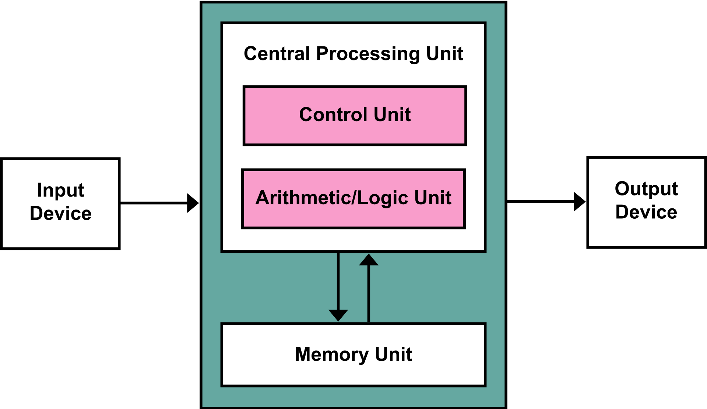
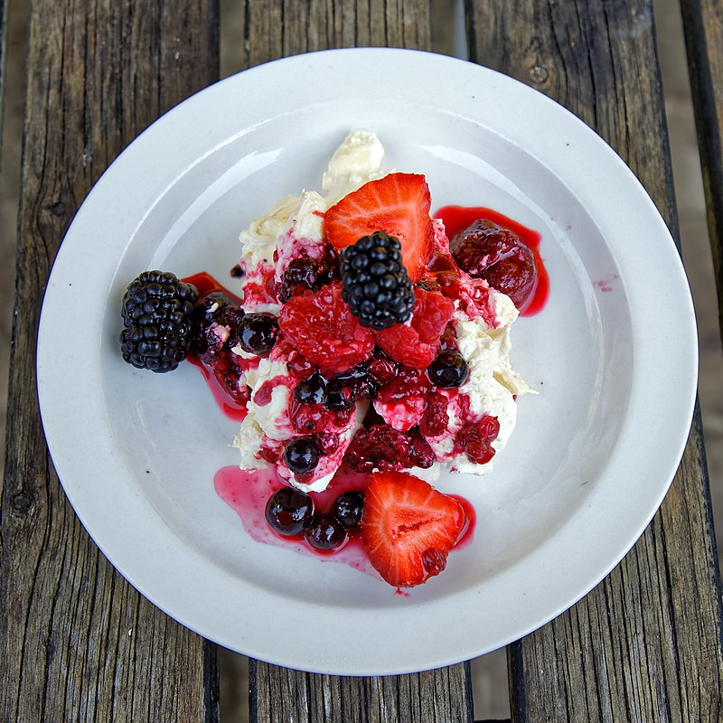

<!-- _class: titlepage -->

# Databases In Other Applications

---

# By the end of this session you will:

  - Understand what is meant by system architecture, layers and tiers.

  - Understand and give examples of applications using the three layer model and two and three tier architectures.

  - Learn about ReST APIs and build a simple web app.


---

<!-- _class: titlepage invert -->

# One, Two and Three Tier Architectures and Layers

---

# Architecture, tiers and layers

- **Architecture**: splitting a computer system up into its components.

  - Here we'll mostly be looking at hardware architecture.

- **Tier**: collection of hardware components -- the system is split into tiers.

  - Historically physical, but could also include logical.

  - Typically **1**, **2**, and **3** tier architectures.

- **Layers:** different from tiers, another way of dividing up a system by splitting up logical components.

---

# Hardware Architecture

- Each piece of hardware is viewed as a black box.

- So we only need to care about **what it does** and **how it communicates**.

- E.g., a database server stores data, which is manipulated or accessed using some kind of program.

---

# Computer system architecture



---

<!-- _class: right-img -->

# One tier architecture

- Everything is contained in one (physical or virtual) server or computer.

- All programs you've made on this course so far are (likely) one tier.

- Simplest but least secure -- if it breaks or is compromised then all is lost!



---

<!-- _class: right-img -->

# Back to layers

- Typically (optimistic) software is not a mess, so a lemon meringue pie, a **layered** desert might be a better analogy. Three layers:

    1. **Presentation:** the crisp top of the meringue,

    2. **Application:** (or business logic) the gooey meringe,

  3. **Data:** tart (bitter?) lemon curd.


---

<!-- _class: right-img -->

# Three Layer Architecture

1. **Presentation:** the crisp top of the meringue

    - User interface -- the pretty part which the user sees and interacts with.

    - Typically HTML/CSS/JavaScript, or a graphics package for C, C++, C#, Java.


---

<!-- _class: right-img -->

# Three Layer Architecture

2. **Application:** (or business logic) is the gooey meringue, providing shape to the system.

    - handles calculations and operations, providing a link between the user interface and the database.

    - Potentially any language, in web apps it's typically PHP but could be Python, JavaScript, Java. etc.


---

<!-- _class: right-img -->

# Three Layer Architecture

3. **Data:** the tangy, slightly bitter lemon curd.

    - Where all data is stored, application layer modifies / inserts / retrieves data and passes it to the presentation layer to be shown to the user.

    - Commonly SQL, but could also be NoSQL.


---

# Three Layer Example

Bob wants to buy a non-existent chocolate bar from Alice's Codelab I vending machine.

- **Presentation**: Bob runs the application and is greeted with a user interface only a programmer could love. With some difficulty, Bob chooses a chocolate bar.

- **Application**: Alice's code stores Bob's choice and checks whether the item is in stock.

---

- **Data**: Stock is stored in a text file. Alice's program determined that there is at least one chocolate bar in stock, deducts one from the stock remaining, and stores this value back in the text file.

- **Application**: having determined the item is in stock and Bob has entered sufficient (non-existent) money, it returns a success value to the `display` function, ...

- **Presentation**: ...which displays the amount of (fake) change and the fact that Bob's (pretend) chocolate has been dispensed.

---

<!-- _class: right-img -->

# 2 Tier Architecture

- **Three layers** are divided across **two** (physical or logical) **tiers**.

- There will be a **communication layer** between the two tiers.


---

<!-- _class: right-img -->

# There are two options

1. **Top**: caramel and chocolate
    - Presentation
    - Application
2. **Bottom**: shortbread biscuit
    - Data


---

<!-- _class: right-img -->

# There are two options

1. **Top**: Royal icing
    - Presentation
2. **Bottom**: cake
    - Application
    - Data


---

<!-- _class: right-img -->

# Three Tier Architecture

- Like a correctly constructed scone.

- A presentation layer of clotted cream,

- with an application layer of jam sticking it all together.


---

# Tiers and Layers

Determine how the three layers in the following examples could be distributed across a two-tier architecture:

1. Vending machine example we saw earlier.

2. Minerva (submitting an assignment).

3. Ticket machine in a train station.

---

<!-- _class: titlepage invert -->

# Web Apps and ReSTful APIs

---

# Another Three Layer Architecture

- Pretty web frontend

- Uses HTTP requests to communicate with a server backend.

- Server processes HTTP requests.

- It retrieves data from and modifies data in the database.

---

# Tiered Architecture

- Two or three tier architecture?

- If two tier, then how would you split the layers?

---

## ReSTful APIs

- **REsource State Transfer** application programming interface.

- Based around **resources**: i.e., documents, data entities.

- Uses HTTP methods to create a specification for how client and server should interact in order to manipulate resources.

---


---

# REST APIs must

- be **stateless**, i.e., no session data is stored on the server and each request contains all data needed to complete it;

- allow resources to be **cached**;

- define a **client-server** architecture. Clients don't care about data storage, servers don't care about user interface;

- conform to the **layered** model;

- provide a **consistent interface**.

---

# How it works

- Client makes an HTTP request to an **API endpoint**, :q


    - identified by its url, e.g., `api/v1/discworld/characters`,

    - **HTTP method** tells server what action to perform, methods match up with *CRUD* operations, e.g., `GET` is *read*,

    - client sends data in a standard format, e.g., *JSON*.

- server processes the request: accesses the database and get data ready to return.

---

- Server returns a response.

    - The **status code** reports on the outcome of the request,

    - The **response body** contains data, represented in a standard format, e.g., *JSON*.

- Client does whatever it likes with the response. That's the point: one tier doesn't need to know about the other.

---

# HTTP Methods

- **GET**: (*read*) retrieves a resource or resources.

    - Request: `GET api/v1/discworld/characters`,

    - Response: status 200 (OK), body
        ```
        [
            {"id": 1, "name": "Granny Weathervax", ... },
            {"id": 2, "name": "Death", ... },
            {"id": 3, "name": "Rinsewind (Wizzard)", ... },
            ...
        ]
        ```

---

# HTTP Methods


- **POST** (*create*) add a new resource.

    - Request `POST api/v1/discworld/characters`, body
        ```
        {
            "name": "Rincewind",
            "occupation": "wizzard",
            "location": "Unseen University"
            "books": [ 1, 2, 4, ... ]
        }
        ```
    - Response: status 201 (Created), body
        ```
        {"id": 4, "name": "Rincewind", ...}
        ```
---

# HTTP Methods

- **PUT** (update, see also *PATCH*) modifies an existing resource.

    - Request: `PATCH api/v1/dicworld/characters/4`, body
        ```
        {"location": "4X"}
        ```
    - Response: status 200 (OK), body
        ```
        {"id": 4, "name": "Rincewind", ...}
        ```

---

# HTTP Methods

- **DELETE** (*figure it out yourself!*) removes a resource.

    - Request: `DELETE api/v1/discworld/characters/4`

    - Response: status 200 (OK), empty body.

---

# Responses

- Common status codes
    - **200** OK
    - **201** Created
    - **400** Bad Request (failed validation)
    - **403** Forbidden (not allowed to do that, e.g., not logged in, can't delete Death)
    - **404** Not Found (nonexistent resource)
    - **500** Internal Server Error (naughty programmer)


---

# Task: Make a REST API

- In `setup-db_starter.py`, define your schema and insert some test data.

- Take a look at `app_starter.py` and start up the web server (instructions in the README).

    - Complete the `GET` endpoint in `app_starter.py` to return all books, along with their average rating and number of ratings.

    - Complete the `POST` endpoint in `app_starter.py` to add a rating.


