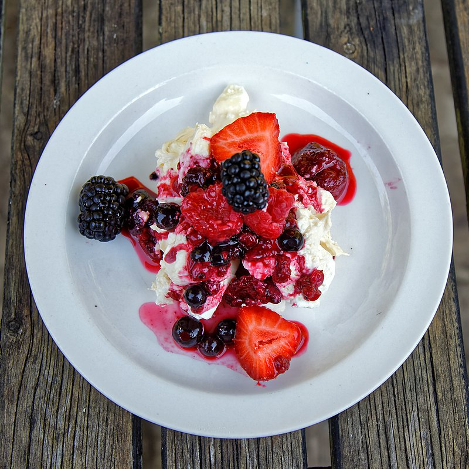

<!-- _class: titlepage -->

# Web APIs

## Based on "Databases in other applications"

Credit: Ed Longford

---

# Plan for today...

- **Tiers and layers**: a quick overviww (you may have seen this in databases...)
- **Rest APIs**: what they are, and how to build them.
- **Coding challenge**: build a web app in JavaScript which uses a rest API.


---

<!-- _class: titlepage invert -->

# One, Two and Three Tier Architectures and Layers

---

# Architecture, tiers and layers

- **Architecture**: splitting a computer system up into its components.

  - Here we'll mostly be looking at hardware architecture.

  - **Tier**: collection of hardware components -- the system is split into tiers.

  - Historically physical, but could also include logical.

  - Typically one, two and three tiered architectures are used. 
  
- **Layers:** different from tiers, another way of dividing up a system by splitting up logical components.

---

# Hardware Architecture

- Each piece of hardware is viewed as a "*black box*".

- All we need to know is it's expected inputs and outputs - we don't need to care about its implementation details.

- E.g., a database server stores data, which is manipulated or accessed using some kind of program.

---

# Computer system architecture


---

<!-- _class: right-img -->

# One tier architecture

- Everything is contained in one program / physical server

- Simplest, but least robust and secure. 



---

<!-- _class: right-img -->

# Back to layers

- Typically (optimistic) software is not a mess, so a lemon meringue pie, a **layered** desert might be a better analogy. Three layers:

    1. **Presentation:** the crisp top of the meringue,

    2. **Application:** (or business logic) the gooey meringe,

  3. **Data:** tart (bitter?) lemon curd.


---

<!-- _class: right-img -->

# Three Layer Architecture

1. **Presentation:** the crisp top of the meringue

    - User interface -- the pretty part which the user sees and interacts with.

    - HTML, CSS and JavaScript -- you've been decorating deserts during Web Dev 1 so far...


---

<!-- _class: right-img -->

# Three Layer Architecture

2. **Application:** (or business logic) is the gooey meringue, providing shape to the system.

    - handles calculations and operations, providing a link between the user interface and the database.

    - Potentially any language, in web apps it was historically PHP but could be almost any language: Ruby, Python, JavaScript, Java...


---

<!-- _class: right-img -->

# Three Layer Architecture

3. **Data:** the tangy, slightly bitter lemon curd.

    - Where all data is stored, application layer modifies / inserts / retrieves data and passes it to the presentation layer to be shown to the user.

    - Commonly a database.


---

# Today, we'll focus on the presentation and application layers...

We'll leave the database layer for Ed ;)

---

<!-- _class: right-img -->

# 2 Tier Architecture

- **Three layers** are divided across **two** (physical or logical) **tiers**.

- There will be a **communication layer** between the two tiers.


---

<!-- _class: right-img -->

# There are two options

1. **Top**: caramel and chocolate
    - Presentation
    - Application
2. **Bottom**: shortbread biscuit
    - Data


---

<!-- _class: right-img -->

# There are two options

1. **Top**: Royal icing
    - Presentation
2. **Bottom**: cake
    - Application
    - Data


---

<!-- _class: right-img -->

# Three Tier Architecture

- Like a **correctly constructed** scone.

  - A presentation layer of clotted cream,

  - with an application layer of jam sticking it all together.


---

# Tiers and Layers

Determine how the three layers in the following examples could be distributed across a two-tier architecture:

1. The CodeLab I Vending Machine 

2. Minerva (submitting an assignment).

3. Ticket machine in a train station.

---
<!-- _class: titlepage invert -->

# Web Apps and ReSTful APIs

---

# Another Three Layer Architecture

- **Client**: pretty web frontend

  - Uses HTTP requests to communicate with a server backend.

- **Server**: processes HTTP requests.

  - Retrieves data from and modifies data in the database.

  - Sends a *response* back to the client.

---

## ReSTful APIs

- **REsource State Transfer** application programming interface.

- Based around **resources**: i.e., documents, data entities.

- Uses HTTP methods (GET, POST, etc) to create a specification for how client and server should interact in order to manipulate resources.

---


---

# REST APIs must

- be **stateless**, i.e., no session data is stored on the server and each request contains all data needed to complete it;

- allow resources to be **cached**;

- define a **client-server** architecture. Clients don't care about data storage, servers don't care about user interface;

- conform to the **layered** model;

- provide a **consistent interface**.

---

# How it works

- Client makes an HTTP request to an **API endpoint**,

    - identified by its url, e.g., `api/v1/discworld/characters`,

    - **HTTP method** tells server what action to perform, methods match up with *CRUD* operations.

    - client sends data in a standard format, e.g., *JSON* (yum) or *XML* (yuck).

- Server processes the request: 

  typically accesses a database and transforms the data into a format easily processed by the client (JSON, HTML web page).

---

## The Response

- Server returns a response.

    - The **status code** reports on the outcome of the request,

    - The **response body** contains data, represented in a standard format, e.g., *JSON*.

- Client does whatever it likes with the response. That's the point: one tier doesn't need to know about the other.

---

# HTTP Methods

- **GET**: (*read*) retrieves a resource or resources.

    - Request: `GET api/v1/discworld/characters`,

    - Response: status 200 (OK), body
        ```
        [
            {"id": 1, "name": "Granny Weathervax", ... },
            {"id": 2, "name": "Death", ... },
            {"id": 3, "name": "Rinsewind (Wizzard)", ... },
            ...
        ]
        ```

---

# HTTP Methods

- **POST** (*create*) add a new resource.

    - Request `POST api/v1/discworld/characters`, body
        ```
        {
            "name": "Rincewind",
            "occupation": "wizzard",
            "location": "Unseen University"
            "books": [ 1, 2, 4, ... ]
        }
        ```
    - Response: status 201 (Created), body
        ```
        {"id": 4, "name": "Rincewind", ...}
        ```
---

# HTTP Methods

- **PUT** (update, see also *PATCH*) modifies an existing resource.

    - Request: `PATCH api/v1/discworld/characters/4`, body
        ```
        {"location": "4X"}
        ```
    - Response: status 200 (OK), body
        ```
        {"id": 4, "name": "Rincewind", ...}
        ```

---

# HTTP Methods

- **DELETE** (*no prizes for what this deos...*) removes a resource.

    - Request: `DELETE api/v1/discworld/characters/4`

    - Response: status 200 (OK), empty body.

---

# How ell do you know your HTTP status codes?

---

# Responses

- Common status codes
    - **200** OK
    - **201** Created
    - **400** Bad Request (failed validation)
    - **403** Forbidden (not allowed to do that, e.g., not logged in, can't delete Death)
    - **404** Not Found (nonexistent resource)
    - **500** Internal Server Error (naughty programmer)

---
<!-- _class: titlepage invert -->

# Coding challenge

---

## Communicate with a REST api!

