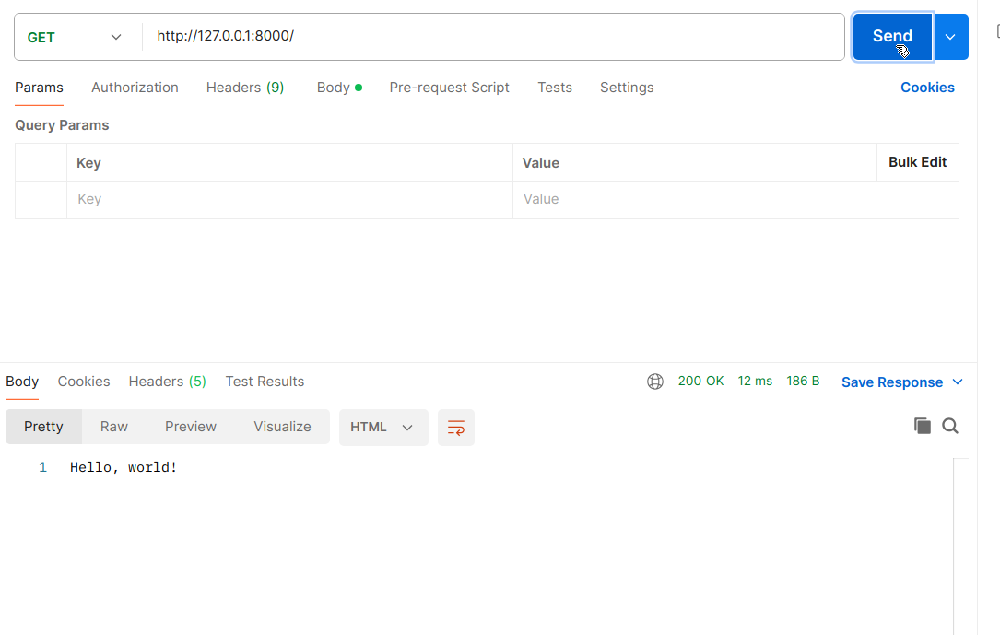
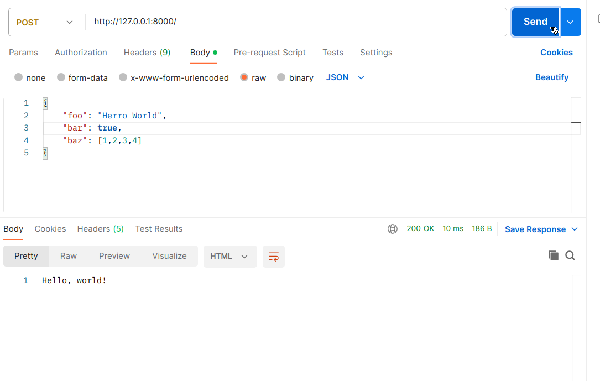

# Rate My Book - A REST API

Your task is to create a database backend to work with a REST API which can be used to rate books.

There are two endpoints

- **GET**  `/books`: return a list of books in JSON format
- **POST** `/books/<id>/ratings`: allows the user to submit a rating for a book with `id`. This can be done by sending
  the JSON object specifying the number of stars. E.g.,
  ```
  { "stars": <number-of-stars> }
  ```

You can test your API using Postman: [https://www.postman.com/downloads/](https://www.postman.com/downloads/).

## Set up

```bash
# create and activate a virtual environment (don't forget the 3!)
python3 -m venv venv
. venv/bin/activate
# now install Flask
pip3 install Flask
```


## Hello world

Take a look at the starter code in `app_starter.py`.

The code below creates a web server.

```python
# create a flask app
app = Flask(__name__)
```

This code runs when the program starts (it's python's main function). It starts up the web server.
```python
# start the app on localhost (127.0.0.1), port 8000
if __name__ == '__main__':
    app.run(host="1270.0.0.1", port=8000, debug=True)
```

Each "route" matches on the URL and the HTTP method used.
```python3
@app.route('/', methods=['GET', 'POST'])
def hello_world():
    # return <request-body>, <status-code>
    # request-body is the data to be sent back. in this case it's text, but jsonify(...) lets you turn a python
    # dictionary into json
    # status-code is the HTTP status, see [MDN documentaton
    # here](https://developer.mozilla.org/en-US/docs/Web/HTTP/Reference/Status).
    return "Hello, world!", 200
```

Run `app_starter.py`. You should see something like this:
```
$ python3 app_starter.py
 * Serving Flask app 'app_starter'
 * Debug mode: on
WARNING: This is a development server. Do not use it in a production deployment. Use a production WSGI server instead.
 * Running on http://127.0.0.1:8000
Press CTRL+C to quit
 * Restarting with stat
 * Debugger is active!
 * Debugger PIN: 157-973-405
```

Go to `http://127.0.0.1:8000` in a web browser, where you should see a page showing `Hello, world!` and an entry in your
terminal (or wherever your running `app_starter.py`) like this:
```
127.0.0.1 - - [02/May/2025 20:45:30] "GET / HTTP/1.1" 200 -
```
You can also use `print(...)` statements to print stuff to the logs.

## Postman

[Postman](https://www.postman.com/) is an app which lets you make HTTP requests. It may be helpful in testing your API.
It can either be installed or used [via your web browser](https://go.postman.co/home), but the browser version forces you to log in (sigh).

You can make the same request as you did in the web browser by doing a `GET`.



Postman can also do POST, PUT, PATCH and DELETE requests (select the method from the dropdown on the left). You can send
JSON data in the request body as follows:

1. Below the box where you enter the URL, select the "Body" tab.
2. Below the tabs, select "Raw" and on the right, in the dropdown, select "JSON".
3. Enter your JSON in the text box below.



## Make a RESTful API using flask

```python
from flask import Flask, jsonify, request

app = Flask(__name__)

# Sample data
data = [
    {"id": 1, "name": "Granny Weathervax"},
    {"id": 2, "name": "Death"},
    {"id": 3, "name": "Rinsewind (Wizzard)"},
]

# retrieve all characters
@app.route('/characters', methods=['GET'])
def find_all():
    return jsonify(data)

# get one character by id
@app.route('/characters/<int:id>', methods=['GET'])
def find_by_id(book_id):
    character = next((ch for ch in data if ch["id"] == id), None)

    return jsonify(character) if character else (jsonify({"error": "Character not found"}), 404)

if __name__ == '__main__':
    app.run(debug=True)
```
## Add an SQLite3 Database

```bash
# install db-sqlite3
pip3 install db-sqlite3
```

## Make an SQLite3 database, connect to it and define the schema

```python
import sqlite3

# connect to the database
connect = sqlite3.connect('database.db')

# define the schema
# e.g., create the characters table
connect.execute(
    'CREATE TABLE IF NOT EXISTS characters (\
        id integer PRIMARY KEY,\
        name text NOT NULL\
    )'
)

# ... more tables ...

# then insert some test data
cursor = connect.cursor()
cursor.execute('INSERT INTO characters (id, name) VALUES\
    (1, "Granny Weathervax"),\
    (2, "Death"),\
    (3, "Rinsewind (Wizzard)")'
)
connect.commit()
```

## Use the database in the rest API

E.g.,
```python
# given an array of rows, each of which is an array, add the given labels to each row
def with_labels(rows, labels):
    return [dict((labels[i], value) for i, value in enumerate(row)) for row in rows]

# retrieve all characters
@app.route('/characters', methods=['GET'])
def find_all():
    # connect and get cursor
    db = sqlite3.connect('database.db')
    cursor = db.cursor()

    # get all characters
    cursor.execute('SELECT id, name FROM characters')
    data = with_labels(cursor.fetchall(), ("id", "name"))

    # return characters as JSON
    return jsonify(data)

# add a new book
@app.route('/characters', methods=['POST'])
def create():
    # connect and get cursor
    db = sqlite3.connect('database.db')
    cursor = db.cursor()

    # get post data as JSON
    data = request.json

    # TODO validate the data! return a 400 response if bad data sent, e.g.,
    # return jsonify({ "error": "Nome field is required." }) 400

    # insert the data
    cursor.execute('INSERT INTO characters (name) VALUES (?)', (data["name"]))
    db.commit()

    return jsonify({ "success": True }), 201 # 201 means created
```

# Your Task

- In `setup-db_starter.py`, define your schema and insert some test data.

- Take a look at the rest of `app_starter.py`. Note the two endpoints `GET /books` and `POST /books/<id>/ratings/`.

- Complete the `GET` endpoint in `app_starter.py` to return all books, along with their average rating and number of
  ratings.

- Complete the `POST` endpoint in `app_starter.py` to add a rating.

- I have finished, what now?

Do your S2 assessment?

But I'm procrastinating really, really hard and would rather do *anything* else.

Alright, how about these extension tasks?

	- Create a `GET /books/<id>` endpoint to retrieve info for an individual book.

	- Create a POST endpoint for `/books` to add a new book.

	- Create a `PUT` (to update) and `DELETE` endpoints for books. Now you have a full REST api!

	- Add more to your ratings system, e.g., allow the user to leave their name or a message.

